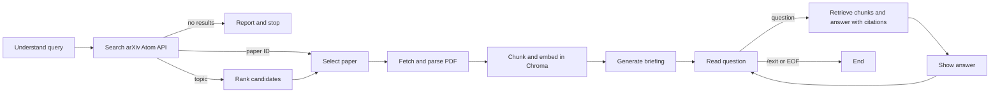

# arXiv Paper Digest & QA

A CLI agent that finds one arXiv paper, creates a structured briefing, and answers follow-up questions from cited paper passages.

## Quick Start

1. Use Python 3.11+ and create a virtual environment: `py -m venv .venv`
2. Activate it: `.\.venv\Scripts\Activate.ps1`
3. Install dependencies: `python -m pip install -r requirements.txt`
4. Add your Groq key to the project-root `.env`: `GROQ_API_KEY=...`
5. Run `python main.py "KV cache optimization"` or `python main.py "2401.12345"`

Choose a paper from the ranked list when searching a topic. At the QA prompt, type `/exit` to finish. Run `python main.py --show-graph` to print the compiled graph, its edges, and the shared state schema without using an API key. Run tests with `python -m unittest discover -s tests -v`.

Logs are written to a new file such as `logs/log_20260927_154300_123456.txt` for each run. They contain INFO and WARNING events and are not mirrored to the console. Earlier logs are preserved; `logs/` is git-ignored. The first embedding run downloads Chroma's ONNX `all-MiniLM-L6-v2` model into the local cache.

## Graph and State



| File | Purpose |
|---|---|
| `arxiv_digest/graph.py` | Builds and compiles the LangGraph; defines nodes, edges, conditional routes, and QA loop. |
| `arxiv_digest/state.py` | Defines the shared `DigestState`: query, paper metadata, parsed sections, Chroma reference, briefing, and conversation. |
| `arxiv_digest/nodes/query.py` | Classifies topic input versus arXiv ID or URL. |
| `arxiv_digest/nodes/retrieval.py` | Searches the official Atom API and parses candidate metadata. |
| `arxiv_digest/nodes/selection.py` | Ranks topic results and lets the user select a paper. |
| `arxiv_digest/nodes/parsing.py` | Fetches the PDF, extracts text, and detects sparse extraction. |
| `arxiv_digest/nodes/indexing.py` | Chunks paper text, embeds it, and stores it in Chroma. |
| `arxiv_digest/nodes/briefing.py` | Produces the structured executive briefing. |
| `arxiv_digest/nodes/qa.py` | Retrieves relevant chunks and answers with chunk citations. |

`DigestState.messages` uses `Annotated[list[AnyMessage], add_messages]` to append human and assistant turns. Recent turns clarify follow-ups, but only retrieved paper chunks support answers. If no chunk meets the similarity threshold, QA responds `Not found in paper.` Conversation state lasts for one run and is not persisted.

## Output and Failure Behavior

The briefing includes title, authors, arXiv ID, publication date, link, summary, problem, methods, results, limitations, and follow-up questions. Briefing input is limited to 14,000 characters and prioritizes key sections to fit Groq request limits.

Topic search starts with up to 10 results. If no results are found, it broadens once. If arXiv repeatedly rejects a topic query with HTTP 406, the agent tries one first-term search; if that also fails, it reports temporary unavailability and exits cleanly. If PDF text extraction is too sparse, it uses the abstract and marks the briefing `partial: true` rather than inventing missing details.

## Provider and Limits

The only LLM is Groq's Python client using model ID `qwen/qwen3.8-27b`. Confirm this ID is available to your account and check its current RPM, TPM, and RPD limits in the Groq Console; quotas vary by model and account tier. The exact values are shown on the account's Limits page: [Groq rate limits](https://console.groq.com/docs/rate-limits).

Embeddings use Chroma's local ONNX `all-MiniLM-L6-v2`; vectors are stored under `.paper_digest_chroma/`. Both Atom API requests and PDF downloads use `curl_cffi` with Chrome impersonation. This avoids the repeated HTTP 406 responses seen with the standard Requests transport in this environment. It is a compatibility mitigation, not proof of the server's blocking mechanism; fingerprint rules can change and may require a newer impersonation target.

## Example Run

Representative output for `python main.py 1706.03762` (exact model wording and chunk IDs may vary):

```text
Executive briefing
{
  "title": "Attention Is All You Need",
  "authors": ["Ashish Vaswani", "Noam Shazeer", "Niki Parmar", "Jakob Uszkoreit", "Llion Jones", "Aidan N. Gomez", "Lukasz Kaiser", "Illia Polosukhin"],
  "arxiv_id": "1706.03762",
  "publish_date": "2017-06-12",
  "link": "https://arxiv.org/abs/1706.03762",
  "summary": "The paper introduces the Transformer, an encoder-decoder architecture based solely on attention. It reports 28.4 BLEU on WMT 2014 English-to-German and 41.8 BLEU on English-to-French, with greater parallelization and reduced training time.",
  "problem_statement": "Recurrent and convolutional sequence models limit parallel computation and can require substantial training time.",
  "method": ["Stacked self-attention and position-wise feed-forward layers", "Multi-head attention and positional encodings"],
  "key_results": ["28.4 BLEU on English-to-German", "41.8 BLEU on English-to-French"],
  "limitations": ["No dedicated limitations section is stated; experiments cover translation and constituency parsing."],
  "suggested_followup_questions": ["How does multi-head attention work?", "What were the translation scores?"],
  "partial": false
}

Q> What does the Transformer replace?
A> It dispenses with recurrence and convolutions, using attention mechanisms throughout. [c0003, c0004]

Q> What score did it report for English-to-French?
A> 41.8 BLEU on WMT 2014 English-to-French after 3.5 days on eight GPUs. [c0012]

Q> What was the result on medical image segmentation?
A> Not found in paper.

Q> /exit
```

## Design Decisions and Tradeoffs

The graph uses small Python node functions rather than an orchestration framework beyond LangGraph itself. arXiv's official Atom API provides metadata and candidates; selecting among topic results is interactive to avoid silently guessing. Chroma and its ONNX embedding model keep embeddings local without a PyTorch runtime or second hosted service.

PDF parsing uses PyMuPDF and simple heading recognition, not advanced layout recovery. Sparse extraction falls back to the abstract with a partial flag. QA uses a fixed similarity threshold and requires retrieved chunk citations, favoring refusal over unsupported answers. Conversation state exists only for the current run.

Not built: multi-paper comparison, citation graphs, non-arXiv sources, fine-tuning, caching, streaming, persistent sessions, UI, authentication, deployment, or Docker. The assessment requests a four-minute video reflection; that remains a separate submission task.
"# arxiv_digest" 
"# arxiv_digest" 
